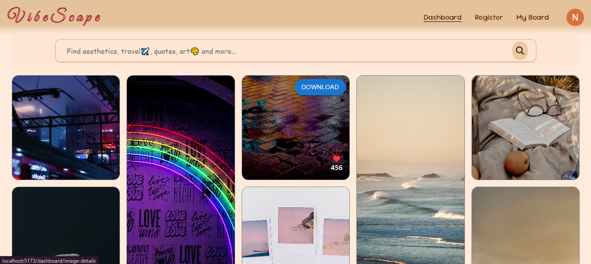

# 📸 Vibescape – Discover Aesthetic Images Effortlessly  
# ONGOING Project/ WORK IN PROGRESS
Vibescape is an **image discovery platform** that curates **high-quality, aesthetic visuals** from Unsplash. Whether you're looking for inspiration or just want to explore beautiful imagery, Vibescape makes it effortless.  

## 👉 [Visit Vibescape](https://vibescape.netlify.app/dashboard)

## ✨ Features  
- **Dynamic Image Search** – Find images based on your vibe.  
- **High-Quality Visuals** – Powered by Unsplash API.  
- **Minimal & Engaging UI** – Smooth navigation for a distraction-free experience.  
- **Like & Download Options** – Save your favorites instantly.  

## 🛠 Tech Stack  
- **Frontend:** ReactJs, Bootstrap CSS
- **backend:** node.js, Express.js
- **API Integration:** Unsplash API  
- **State Management:** React Hooks 

---

🚀 **Find. Explore. Vibe.**  
